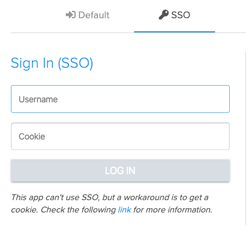
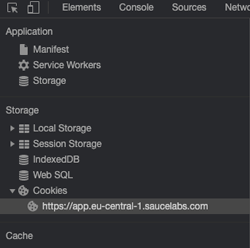
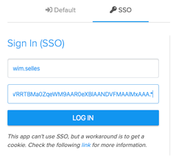

# vUSB GUI and SSO
If your organisation if using SSO then you have a `username`, but you don't have a `password`. The Sauce Labs vUSB GUI
is not connected to SSO, but there is a workaround which will let you use this tool and is explained below.

## SSO workarounds
The original app only used the cookie method to allow access, but given it used the access key behind the scenes, it was easy enough to add.

### Access Key
1. Login to your Sauce Labs account using the usual SSO method
1. When you are signed in, go to **Account** > **User Settings** and copy the `username` and fill it in the 
   SSO-`username` field. (*This value will automatically be stored for future sign in sessions.*)
1. On the same screen, copy the `access_key` and fill it in the `access_key/cookie` field.

### Cookie
When you [sign in to the Sauce Labs cloud](https://accounts.saucelabs.com), Sauce Labs will set a cookie which is called 
the `sl-auth`-cookie. The workaround is to copy the cookie from Sauce Labs and fill it in the `cookie` field. 
Please follow the following steps to use SSO with vUSB. 

> NOTE 1: The cookie can only be used for 30 minutes. If the session you have open with the vUSB GUI is longer than 30 
> minutes you will get an error when trying to retrieve the devices. You can click on `Log out` and repeat the steps.
> If that doesn't work then close the vUSB GUI and restart it.

> NOTE 2: The steps below use Chrome as an example, but this will work with whatever your favourite browser is.

1. Open a browser and Sign in to Sauce Labs with SSO
1. When you are signed in, go to **Account** > **User Settings** and copy the `username` and fill it in the 
   SSO-`username` field. (*This value will automatically be stored for future sign in sessions.*)

   

1. Now open [DevTools](https://developers.google.com/web/tools/chrome-devtools/open) in your browser.
1. Go to the `Application`, this is where you can find all the `Local|Session|Cookie`-storage
1. Open the `Cookies`-dropdown on the left as shown in the below image
   
    

1. In the search-bar enter the value `sl-auth`. The cookies will be filtered and the `sl-auth`-cookie will be shown as 
   seen below

    

1. Copy the value and paste it into the SSO Sign in form in the `access_key/cookie`-field as seen below

    

1. Click on `LOG IN` and you should be logged in. If not  then please repeat the steps.
